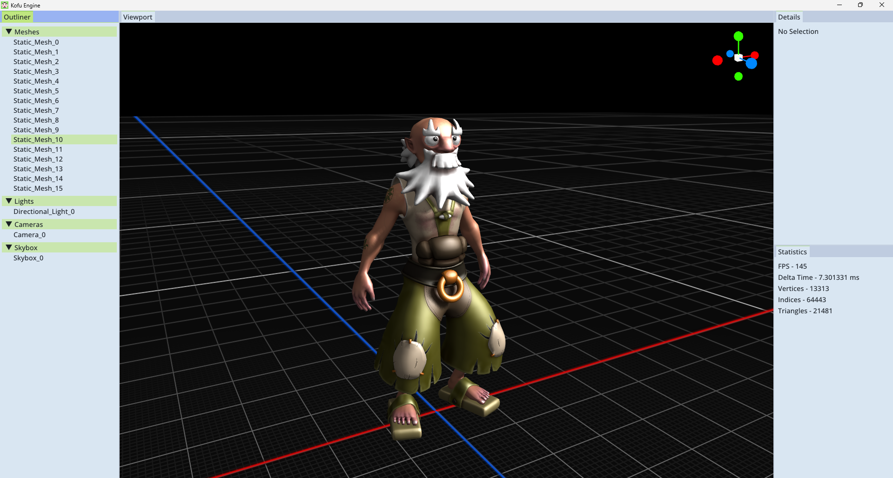
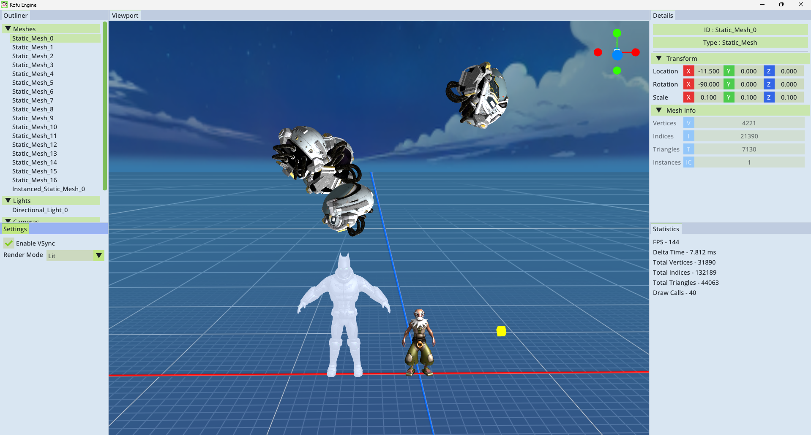

<h1 align="center">Kofu Engine</h1>

  

  <b>A 3D Hobby Graphics Engine built with C++ and OpenGL 4.6.</b> 
  <b>Focused on Real-time Rendering and Graphics Engine fundamentals.</b>

## Features

* **Core Framework:** GLFW-based windowing and Glad-based OpenGL 4.6 loading.
* **Rendering Architecture:** Custom abstractions for Vertex Buffers (VBO), Index Buffers (EBO), Vertex Arrays (VAO), and Framebuffers (FBO).
* **Scene Management:** Supports Static Meshes, Instanced Static Meshes, Quads, Lights, Skyboxes, and Shadow Maps.
* **Asset Pipeline:** Custom GLTF mesh parser using **tinygltf** and texture loading via **stb_image**.
* **Lighting & Shadows:** Directional, Point, and Spot light support with integrated Shadow Mapping.
* **Environment:** Skybox implementation using Cubemap textures and a quad-based grid with X/Z axis visualization.
* **Shaders:** Dedicated Shader class for managing Vertex, Fragment, and Geometry GLSL shaders.
* **Camera System:** Perspective camera featuring smooth mouse-look and standard WASDQE movement controls.
* **Audio Engine:** OpenAL-based spatial audio with Source and Listener component architecture.
* **User Interface:** Comprehensive editor suite built with **ImGui**:
    * **Primary Panels:** Viewport, Scene Outliner, Engine Stats (Draw calls, Triangle count, etc.), and Settings.
    * **Detail Panels:** Transform, Mesh, Light, and Camera property editors.
* **Gizmos:** Custom-built world-direction gizmo for intuitive viewport navigation.

## Tech Stack

* **Language:** C++
* **Graphics API:** OpenGL 4.6
* **Libraries:** Glad, GLFW, ImGui, TinyGltf, JsonParser, OpenAL, StbImage

## Screenshots

  
  
  
  

